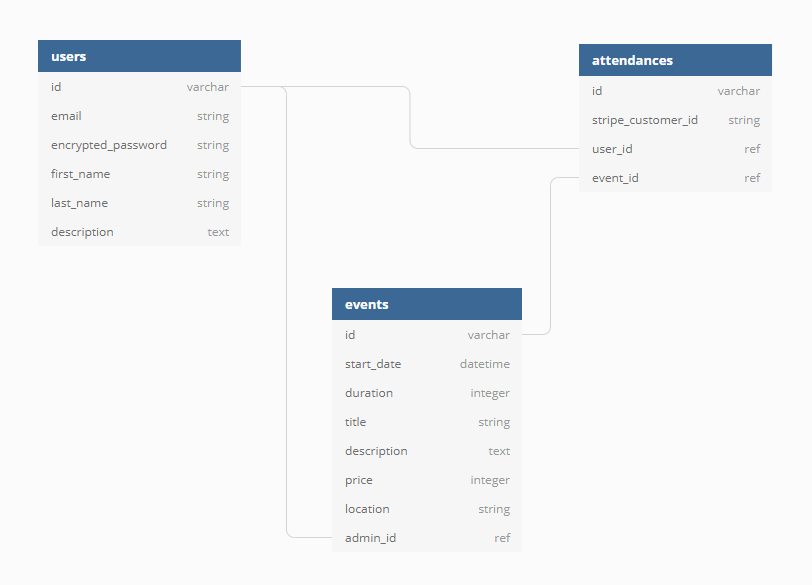

# README

## Install

1. add gems
   - all : simple_form, faker
   - dev + test : rspec-rails, factory_bot_rails, hirb
   - test : shoulda_matchers, rails-controller-testing, nyan-cat

2. change db config info (for windows)
3. run `rails generate rspec:init`
4. run `rails generate simple_form:init`
5. add to `.rspec`:
   - --require rails_helper
   - --format documentation (or nyan-cat...?)
6. create db

### Schema de la base de données

(fait [ici](https://dbdiagram.io/d/5c5e7fb47db47000147036ce))

